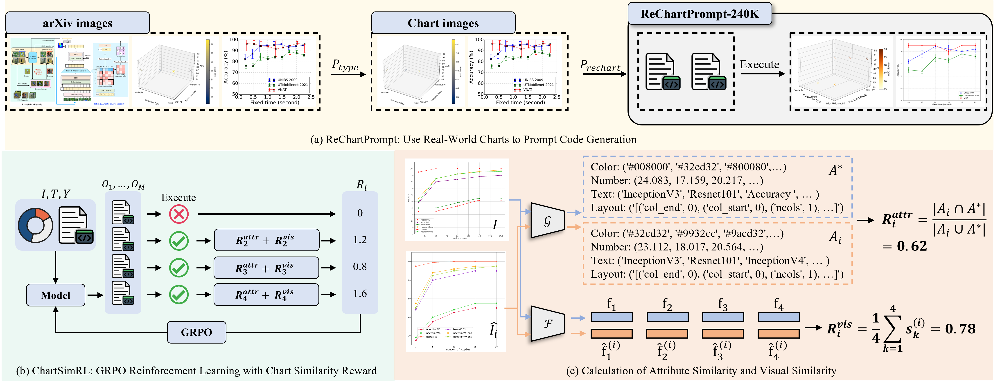

# ChartMaster: Advancing Chart-to-Code Generation with Real-World Charts and Chart Similarity Reinforcement Learning

This project constructs a large-scale and highly diverse dataset (ReChartPrompt-240K), and introduces a GRPO-based RL algorithm (ChartSimRL) to effectively align generated charts with their references in both visual and semantic aspects. As a result, ChartMaster achieves performance competitive with GPT-4o using only 7B parameters.
