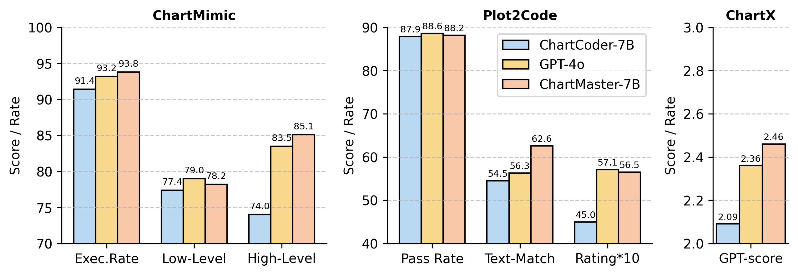

<h1 align="center">
<br>
ChartMaster: Advancing Chart-to-Code Generation with Real-World Charts and Chart Similarity Reinforcement Learning
</h1>

<div align="center">


</div>

<p align="center">
  <a href="https://wentaotan.github.io/ChartMaster/"><b>[🌐 Website]</b></a> •
  <a href="https://huggingface.co/datasets/TwT-6/ReChartPrompt-240K"><b>[🤗 Dataset]</b></a> •
  <a href="TODO"><b>[📜 Paper]</b></a> •
  <a href="https://github.com/WentaoTan/ChartMaster"><b>[🐱 GitHub]</b></a> 
</p>

<br>


## 🔥 News

- [2025/08/25] ChartMaster paper, repo and website released.


## 💡 Introduction

<div style="text-align: justify;">
ChartMaster is a new framework for chart-to-code generation, enabling Multimodal Large Language Models (MLLMs) to convert chart images into executable code. This task is essential for automated data analysis, report generation, and intelligent question answering, but faces two key challenges: dataset diversity and visual consistency.

Previous datasets mainly use synthetic seeds to prompt GPT models, resulting in homogeneous samples and limited generalization. To address this, we propose <b>ReChartPrompt</b>, a large-scale automatically constructed dataset based on 30,071 real arXiv papers, yielding 240K diverse chart-image/code/instruction triplets. These real-world charts cover rich design styles and research fields, greatly enhancing model robustness.

The second challenge is that traditional supervised fine-tuning (SFT) improves code understanding but cannot guarantee visual fidelity. We introduce <b>ChartSimRL</b>, a reinforcement learning algorithm based on Group Relative Policy Optimization (GRPO), guided by a novel chart similarity reward. This reward combines <i>attribute similarity</i> (matching layout, color, text, and values) and <i>visual similarity</i> (comparing CNN-extracted features), ensuring generated charts align closely with originals in both semantics and appearance.

By integrating ReChartPrompt and ChartSimRL, our <b>ChartMaster</b> model achieves state-of-the-art results among open-source 7B-parameter models, rivaling GPT-4o performance across multiple benchmarks. All code, datasets, and models are released to facilitate further research.
</div>

<br>

<p align="center">
    
    <br>
    <em>
    Figure 1: The overall framework of ChartMaster: (a) Construction of ReChartPrompt-240K with real chart images; (b) Optimization via ChartSimRL; (c) Definition of Chart Similarity reward.
    </em>
</p>


## 📊 Benchmark Results

ChartMaster-7B sets a new SOTA for open-source 7B models across the ChartMimic, Plot2Code, and ChartX benchmarks, even approaching GPT-4o.  
<p align="center">
    
    <br>
    <em>
    Figure 2: Fine-tuning Qwen2.5-VL-7B with ReChartPrompt data significantly enhances performance, and applying ChartSimRL further elevates it to match or exceed GPT-4o on certain metrics. For better representation, the "Rating" metric in the Plot2Code benchmark is multiplied by 10.
    </em>
</p>

<p align="center">
    
    <br>
    <em>
    Figure 3: The test results of various models on the ChartMimic benchmark. ``Base.+ReCha." refers to the baseline model fine-tuned with the ReChartPrompt-240K dataset. Incorporating ReChartPrompt significantly enhances the chart-to-code generation capability of the base model, while ChartSimRL further improves the handling of fine details.
    </em>
</p>

<!--

## 🚀 Quick Start

### ⚙️ Setup

We recommend using [Conda](https://docs.conda.io/projects/miniconda/) for environment management and [vLLM](https://github.com/vllm-project/vllm) for fast inference.

```sh
git clone https://github.com/WentaoTan/ChartMaster.git && cd ChartMaster
conda create -n chartmaster python=3.10
conda activate chartmaster
pip install torch==2.7.1  # (Choose CUDA version if needed)
pip install -r requirements.txt
```

### 🪁 Evaluation

Download our preprocessed data and run evaluation scripts:

```sh
bash scripts/evaluation.sh
```

### ⚡️ Training

We provide full training scripts and data:
- For supervised fine-tuning (SFT) on ReChartPrompt-240K:
```sh
bash scripts/train_sft.sh
```
- For ChartSimRL reinforcement learning:
```sh
bash scripts/train_chartsimrl.sh
```

---

## 🏆 Dataset: ReChartPrompt

- **240K** high-quality chart image / prompt / code triplets
- Extracted from 30,071 arXiv papers, covering diverse styles and fields
- Available at [🤗 Huggingface](https://huggingface.co/datasets/TwT-6/ReChartPrompt-240K)

<p align="center">
    
    <br>
    <em>
    Figure 4: ReChartPrompt exhibits much higher attribute diversity compared to previous datasets, supporting stronger generalization.
    </em>
</p>

---

## 🔖 Citation

If you find this repository helpful, please consider citing our work:

```bibtex
@misc{tan2025chartmaster,
      title={ChartMaster: Advancing Chart-to-Code Generation with Real-World Charts and Chart Similarity Reinforcement Learning}, 
      author={Wentao Tan and coauthors},
      year={2025},
      eprint={TODO},
      archivePrefix={arXiv},
      primaryClass={cs.CL},
      url={https://github.com/WentaoTan/ChartMaster}, 
}
```

---

## 🙏 Acknowledgement

We thank all open-source MLLM, chart generation, and RL community projects, whose work inspired ChartMaster's design and implementation.

---

## 🌟 Star History

[](https://star-history.com/#WentaoTan/ChartMaster&Date)

-->

## 💬 Contact

For questions, suggestions, or collaboration, please feel free to:

- Open an issue.
- Reach out via email:  
  - ftwentaotan@mail.scut.edu.cn  
  - 731584671@qq.com

